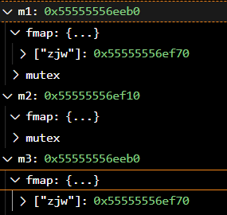

## C++设计模式之单例模式

## 0.导语

* 相信大家面试都逃不开设计模式话题，本节将阐述面试中的最常用的设计模式(单例模式)，从分类，线程安全，不基于C++11标准的角度与基于C++11标准的角度，有哪些解决线程安全的单例模式方案，相信认真看完本篇文章，在以后面试中就不用担忧了。

## [不加`static`测试](./static_singleton_test.cpp)
* 如果`Manager *inst = new Manager();`不加上`static`关键字，可发现`m2`对象的`fmap`字典变量没有`"zjw"`关键字，`m2`是通过静态成员函数`Global()`构造了一个新的`Manager`类型指针对象；`m1`以及`m3`对象中的`fmap`字典变量中均有`"zjw"`关键字。`m3`是通过调用`Manager`的默认拷贝构造函数。




## 1.众所周知的单例

在一般书籍中或者大家比较是熟知的单例模式是下面这样：

```cpp
class singleton {
private:
    singleton() {}
    static singleton *p;
public:
    static singleton *instance();
};

singleton *singleton::p = nullptr;

singleton* singleton::instance() {
    if (p == nullptr)
        p = new singleton();
    return p;
}
```

这是一个非常简单的实现，将构造函数声明为private或protect防止被外部函数实例化，内部有一个静态的类指针保存唯一的实例，实例的实现由一个public方法来实现，该方法返回该类的唯一实例。

当然这个代码只适合在单线程下，当多线程时，是不安全的。考虑两个线程同时首次调用instance方法且同时检测到p是nullptr，则两个线程会同时构造一个实例给p，这将违反了单例的准则。

## 2.懒汉与饿汉

单例分为两种实现方法：

- 懒汉
  - 第一次用到类实例的时候才会去实例化，上述就是懒汉实现。
- 饿汉
  - 单例类定义的时候就进行了实例化。

这里也给出饿汉的实现：

```cpp
class singleton {
private:
    singleton() {}
    static singleton *p;
public:
    static singleton *instance();
};

singleton *singleton::p = new singleton();
singleton* singleton::instance() {
    return p;
}
```

当然这个是线程安全的，对于我们通常阐述的线程不安全，为懒汉模式，下面会阐述懒汉模式的线程安全代码优化。

## 3.多线程加锁

在C++中加锁有个类实现原理采用RAII，不用手动管理unlock，那就是lock_guard，这里采用其进行加锁。

```cpp
class singleton {
private:
    singleton() {}
    static singleton *p;
    static mutex lock_;
public:
    static singleton *instance();
};

singleton *singleton::p = nullptr;

singleton* singleton::instance() {
    lock_guard<mutex> guard(lock_);
    if (p == nullptr)
        p = new singleton();
    return p;
}
```

这种写法不会出现上面两个线程都执行到p=nullptr里面的情况，当线程A在执行`p = new Singleton()`的时候，线程B如果调用了`instance()`，一定会被阻塞在加锁处，等待线程A执行结束后释放这个锁。从而是线程安全的。

但是这种写法性能非常低下，因为每次调用`instance()`都会加锁释放锁，而这个步骤只有在第一次`new Singleton()`才是有必要的，只要`p`被创建出来了，不管多少线程同时访问，使用`if (p == nullptr) `进行判断都是足够的（只是读操作，不需要加锁），没有线程安全问题，加了锁之后反而存在性能问题。

因此引出DCL。

## 4.双重检查锁模式

上面写法是不管任何情况都会去加锁，然后释放锁，而对于读操作是不存在线程安全的，故只需要在第一次实例创建的时候加锁，以后不需要。下面先看一下DCLP的实现：

```cpp
singleton* singleton::instance() {
	if(p == nullptr) {  // 第一次检查
		Lock lock;
		if(p == nullptr){ // 第二次检查
			p = new singleton;
		}
	}
	return p;
}
```

基于上述，我们可以写出双重检查锁+自动回收

```cpp
class singleton {
private:
    singleton() {}

    static singleton *p;
    static mutex lock_;
public:
    singleton *instance();

    // 实现一个内嵌垃圾回收类
    class CGarbo
    {
    public:
        ~CGarbo()
        {
            if(singleton::p)
                delete singleton::p;
        }
    };
    static CGarbo Garbo; // 定义一个静态成员变量，程序结束时，系统会自动调用它的析构函数从而释放单例对象
};

singleton *singleton::p = nullptr;
singleton::CGarbo Garbo;

singleton* singleton::instance() {
    if (p == nullptr) {
        lock_guard<mutex> guard(lock_);
        if (p == nullptr)
            p = new singleton();
    }
    return p;
}

```

DCLP的关键在于，大多数对instance的调用会看到p是非空的，因此甚至不用尝试去初始化它。因此，DCLP在尝试获取锁之前检查p是否为空。只有当检查成功（也就是p还没有被初始化）时才会去获得锁，然后再次检查p是否仍然为空（因此命名为双重检查锁）。**第二次检查是必要，因为就像我们刚刚看到的，很有可能另一个线程偶然在第一次检查之后，获得锁成功之前初始化p。**

看起来上述代码非常美好，可是过了相当一段时间后，才发现这个漏洞，原因是：**内存读写的乱序执行(编译器问题)**。

再次考虑初始化`p`的那一行：

```cpp
p = new singleton;
```

这条语句会导致三个事情的发生：

1. 分配能够存储`singleton`对象的内存；
2. 在被分配的内存中构造一个`singleton`对象；
3. 让`p`指向这块被分配的内存。

可能会认为这三个步骤是按顺序执行的，但实际上只能确定步骤`1`是最先执行的，步骤`2`，`3`却不一定。问题就出现在这。

- 线程A调用instance，执行第一次p的测试，获得锁，按照1,3,执行，然后被挂起。此时p是非空的，但是p指向的内存中还没有Singleton对象被构造。
- 线程B调用instance，判定p非空， 将其返回给instance的调用者。调用者对指针解引用以获得singleton，噢，一个还没有被构造出的对象。bug就出现了。

DCLP能够良好的工作仅当步骤一和二在步骤三之前被执行，但是并没有方法在C或C++中表达这种限制。这就像是插在DCLP心脏上的一把匕首：我们需要在相对指令顺序上定义限制，但是我们的语言没有给出表达这种限制的方法。

## 5.memory barrier指令

DCLP问题在C++11中，这个问题得到了解决。

因为新的C++11规定了新的内存模型，保证了执行上述3个步骤的时候不会发生线程切换，相当这个初始化过程是“原子性”的的操作，DCL又可以正确使用了，不过在C++11下却有更简洁的多线程singleton写法了，这个留在后面再介绍。

C++11之前解决方法是barrier指令。要使其正确执行的话，就得在步骤2、3直接加上一道memory barrier。强迫CPU执行的时候按照1、2、3的步骤来运行。

**第一种实现：**

基于operator new+placement new，遵循1,2,3执行顺序依次编写代码。

```
// method 1 operator new + placement new
singleton *instance() {
    if (p == nullptr) {
        lock_guard<mutex> guard(lock_);
        if (p == nullptr) {
            singleton *tmp = static_cast<singleton *>(operator new(sizeof(singleton)));
            new(tmp)singleton();
            p = tmp;
        }
    }
    return p;
}
```

**第二种实现：**

基于直接嵌入ASM汇编指令mfence，uninx的barrier宏也是通过该指令实现的。

```cpp
#define barrier() __asm__ volatile ("lwsync")
singleton *singleton::instance() {
    if (p == nullptr) {
        lock_guard<mutex> guard(lock_);
        barrier();
        if (p == nullptr) {
            p = new singleton();
        }
    }
    return p;
}
```

通常情况下是调用cpu提供的一条指令，这条指令的作用是会阻止cpu将该指令之前的指令交换到该指令之后，这条指令也通常被叫做barrier。 上面代码中的**asm**表示这个是一条汇编指令，volatile是可选的，如果用了它，则表示向编译器声明不允许对该汇编指令进行优化。lwsync是POWERPC提供的barrier指令。

## 6.静态局部变量

Scott Meyer在《Effective C++》中提出了一种简洁的singleton写法

```cpp
singleton *singleton::instance() {
    static singleton p;
    return &p;
}
```

- 单线程下，正确。
- C++11及以后的版本（如C++14）的多线程下，正确。
- C++11之前的多线程下，不一定正确。

原因在于在C++11之前的标准中并没有规定local static变量的内存模型。于是乎它就是不是线程安全的了。但是在C++11却是线程安全的，这是因为新的C++标准规定了当一个线程正在初始化一个变量的时候，其他线程必须得等到该初始化完成以后才能访问它。

上述使用的内存序：

- memory_order_relaxed：松散内存序，只用来保证对原子对象的操作是原子的
- memory_order_acquire：获得操作，在读取某原子对象时，当前线程的任何后面的读写操作都不允许重排到这个操作的前面去，并且其他线程在对同一个原子对象释放之前的所有内存写入都在当前线程可见
- memory_order_release：释放操作，在写入某原子对象时，当前线程的任何前面的读写操作都不允许重排到这个操作的后面去，并且当前线程的所有内存写入都在对同一个原子对象进行获取的其他线程可见

## 7.Atomic

在C++11之前的版本下，除了通过锁实现线程安全的Singleton外，还可以利用各个编译器内置的atomic operation来实现。

`java`和`c#`发现乱序问题后，就加了一个关键字`volatile`，在声明`p`变量的时候，要加上`volatile`修饰，编译器看到之后，就知道这个地方不能够reorder（一定要先分配内存，在执行构造器，都完成之后再赋值）。

而对于`c++`标准却一直没有改正，所以`VC++`在`2005`版本也加入了这个关键字，但是这并不能够跨平台（只支持微软平台）。

而到了`c++ 11`版本，为了从根本上消除这些漏洞，引入了适合多线程的内存模型。终于有了这样的机制帮助我们实现跨平台的方案。

```cpp
mutex singleton::lock_;
atomic<singleton *> singleton::p;

/*
* std::atomic_thread_fence(std::memory_order_acquire); 
* std::atomic_thread_fence(std::memory_order_release);
* 这两句话可以保证他们之间的语句不会发生乱序执行。
*/
singleton *singleton::instance() {
    singleton *tmp = p.load(memory_order_relaxed);
    atomic_thread_fence(memory_order_acquire);
    if (tmp == nullptr) {
        lock_guard<mutex> guard(lock_);
        tmp = p.load(memory_order_relaxed);
        if (tmp == nullptr) {
            tmp = new singleton();
            atomic_thread_fence(memory_order_release);
            p.store(tmp, memory_order_relaxed);
        }
    }
    return p;
}
```

值得注意的是，上述代码使用两个比较关键的术语，获得与释放：

- 获得是一个对内存的读操作，当前线程的任何后面的读写操作都不允许重排到这个操作的前面去。
- 释放是一个对内存的写操作，当前线程的任何前面的读写操作都不允许重排到这个操作的后面去。

acquire 和 release 通常都是配对出现的，目的是保证如果对同一个原子对象的 release 发生在 acquire 之前的话，release 之前发生的内存修改能够被 acquire 之后的内存读取全部看到。

## 8.pthread_once

如果是在unix平台的话，除了使用atomic operation外，在不适用C++11的情况下，还可以通过pthread_once来实现Singleton。

原型如下：

```
int pthread_once(pthread_once_t once_control, void (init_routine) (void))；
```

实现：

```cpp
class singleton {
private:
    singleton(); //私有构造函数，不允许使用者自己生成对象
    singleton(const singleton &other);

    //要写成静态方法的原因：类成员函数隐含传递this指针（第一个参数）
    static void init() {
        p = new singleton();
    }

    static pthread_once_t ponce_;
    static singleton *p; //静态成员变量 
public:
    singleton *instance() {
        // init函数只会执行一次
        pthread_once(&ponce_, &singleton::init);
        return p;
    }
};
```

## 9.总结

本文讲解了几种单例模式，并讲解了线程安全的单例模式，以及不用C++11实现的几种线程安全的单例模式：memory barrier，静态局部变量，pthread_once方式，C++11的atomic实现等。

最后值得注意的是，针对上述单例类的析构函数请参考双重锁检查模式+自动回收实现，必须在类中声明一个静态局部变量，静态局部变量可以理解为全局变量，在程序结束时，自动调用该静态局部变量的析构函数，这就是为什么要在类中声明与定义嵌套类，而不是直接编写单例的析构函数。

## 10.参考资料

> https://thorns.cn/2019/03/09/DCLP.html

> https://www.cnblogs.com/liyuan989/p/4264889.html

> https://segmentfault.com/a/1190000015950693
