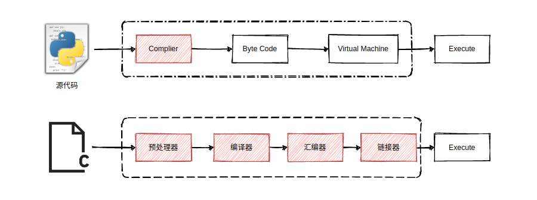

# `cpp`语言特性
* `cpp`属于编译性语言
* `python`属于解释性语言
  


## `cpp`与`python`编程语言在编译上的差异性
* `cpp`编译型语言的主要工作流程如下：
```text
源代码 (source code) → 预处理器 (preprocessor) → 编译器 (compiler) → 目标代码 (object code) → 链接器 (Linker) → 可执行程序 (executables)
```
* `python`属于解释性语言，其主要工作流程如下：
```text
源代码 (source code) → 调用二进制的解释器程序对源码进行解释成字节码 -> 调用python的虚拟机程序执行这些字节码 
```