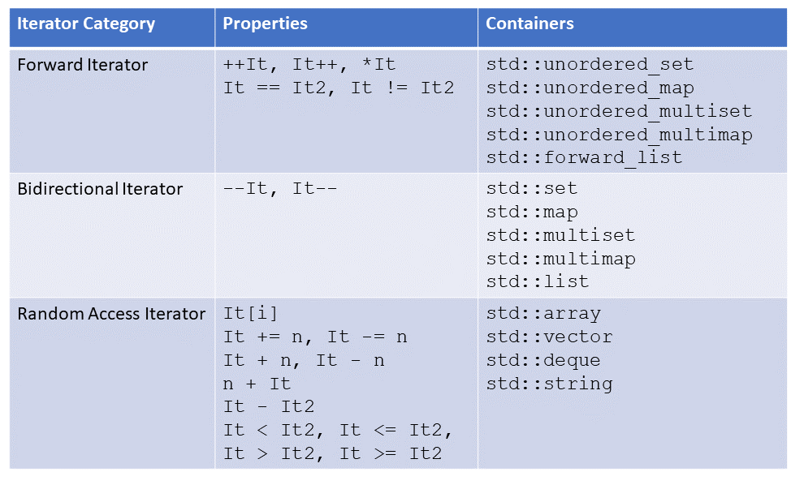

# 常用容器总结

## [`iterator_traits`类模板](./advance_implementation_test.cpp)
* `iterator_traits`萃取技术是通过静态调用不同功能的迭代器以实现对容器元素的算法操作。
* 不同功能迭代器继承关系
```c++
 ///  Marking input iterators.
  struct input_iterator_tag { };

  ///  Marking output iterators.
  struct output_iterator_tag { };

  /// Forward iterators support a superset of input iterator operations.
  struct forward_iterator_tag : public input_iterator_tag { };

  /// Bidirectional iterators support a superset of forward iterator
  /// operations.
  struct bidirectional_iterator_tag : public forward_iterator_tag { };

  /// Random-access iterators support a superset of bidirectional
  /// iterator operations.
  struct random_access_iterator_tag : public bidirectional_iterator_tag { };
```



* `iterator_traits`类模板的属性定义如下：
```c++
template<typename _Iterator>
    struct iterator_traits
    {
      typedef typename _Iterator::iterator_category iterator_category;
      typedef typename _Iterator::value_type        value_type;
      typedef typename _Iterator::difference_type   difference_type;
      typedef typename _Iterator::pointer           pointer;
      typedef typename _Iterator::reference         reference;
    };

template<typename _Tp>
struct iterator_traits<_Tp*>
{
    typedef random_access_iterator_tag iterator_category;
    typedef _Tp                         value_type;
    typedef ptrdiff_t                   difference_type;
    typedef _Tp*                        pointer;
    typedef _Tp&                        reference;
};
```


## [`std::fill`函数模板](./vector_fill_test.cpp)
```c++
template <class ForwardIterator, class T>  void fill (ForwardIterator first, ForwardIterator last, const T& val);
```
* 目前仅支持`vector`类型模板从起始位置到终止位置的元素赋值

## [实现不同容器类型的`std::advance`功能](./advance_implementation_test.cpp)
* `advance_impl`函数模板实现了不同

## [`stl`容器中的`std::advance`函数模板](./list_advance_test.cpp)
```c++
template <class InputIterator, class Distance>  void advance (InputIterator& it, Distance n);
```
* `std::advance`将迭代器向前移动n个元素位置。

## [`vector`之`assign`属性用法](./vector_assign_test.cpp)
* `assign`使用不同的构造函数实现了多种不同的用法对数组进行赋值操作

## [`vector`之`erase`属性用法](./vector_erase_test.cpp)
* 删除指定位置元素，也可以删除指定起始位置到终止位置之间的元素并返回原地址数组

## 参考链接
* 1 [`cppreference`之`vector`的`assign`属性讲解](https://en.cppreference.com/w/cpp/container/vector/assign)
* 2 [`cplusplus`之`std::fill`函数模板讲解](https://cplusplus.com/reference/algorithm/fill/)
* 3 [`modernescpp`之`std::iterator_traits`教程](https://www.modernescpp.com/index.php/softwaredesign-with-traits-and-tag-dispatching)